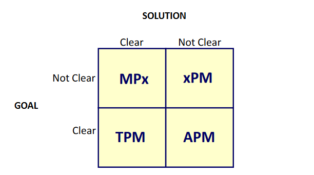
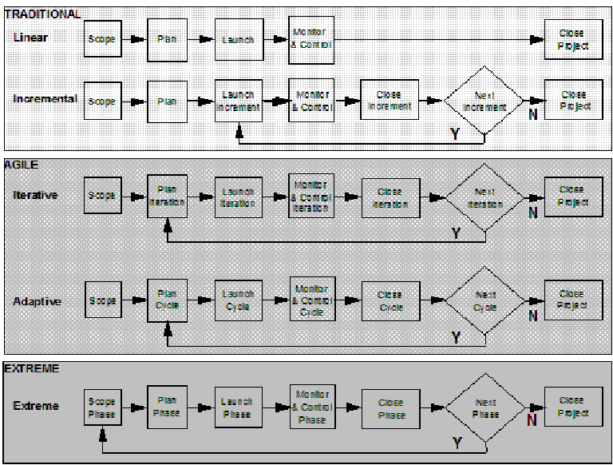

# Definizione di Project Management

## Definizione del PMI (Project Management Institute)

Applicazione di **consocenze**, **capacità**, **strumenti** e **tecniche** alle attività di progetto per soddisfare i requisiti.

## Definizione di Wysocki (1)

Insieme di strumenti, templates e processi che rispondono alle domande ...

- **Quale situazione aziendale affronta il progetto?**: Situazione aziendale = _problema o opportunità_; Se non è possibile definire immediatamente una soluzione, si dovrà usare un approccio per _acquisire conoscenza iterativamente_ (con un conseguente _alto rischio_).
- **Cos'hai bisogno di fare?**: definizione dello _scope_.
- **Cosa farai?**: conseguenza diretta dello scope/deliverable.
- **Come lo farai?**: definizione dell'_approccio_ + _piano dettagliato delle attività_.
- **Come saprai che lo hai fatto?**: espressione misurabile dei _business value_, in termini di _increased revenue_, _avoided cost_ o _improved service_ (criteri di successo).
- **Quanto bene lo hai fatto?**: analisi retrospettiva => miglioramento continuo.

## Definizione di Wysocki (2)

Approccio **organizzato** basato sul "buon senso" (bisogna adattare l'approccio alla situazione specifica) che deve prevedere il **coinvolgimento del cliente** al fine di **soddisfare i requisiti** fornendo il **business value atteso**.

Cliente: responsabile della definizione del business value.
Project Manager: responsabile del soddisfacimento dei requisiti.

## Cosa sono i Requisiti?

> Wysocki: Stato finale desiderato, la cui integrazione con successo nella soluzione fornisce un aumento specifico e misurabile di business value.

Da notare il fatto che questa definizione contempla solo le soluzioni con un adeguato livello di business value.

## Project Management Life Cycle

### Modello di ciclo di vita del Project Management

Sequenza di processi raggruppati nei seguenti 5 gruppi:

- **Scoping**
- **Planning**
- **Execution (launching)**
- **Monitoring & Controlling**
- **Closing**

Ogni gruppo deve apparire almeno una volta (quindi possono anche essere ripetuti).

**TPM** = Traditional Project Management
**xPM** = Extreme Project Management
**APM** = Agile Project Management
**MPx** = Emertxe Project Management

In base al grado di incertezza è possibile scegliere il modello di PM più adatto, tenendo presente che i modelli lineari/incrementali sono più adatti quando i requisiti/la soluzione sono più chiari, e in caso contrario sono più adatti approcci iterativi/adattivi.
Inoltre, quando anche il goal tende a essere poco chiaro, può essere utile adottare un modello extreme per far fronte ai frequenti cambiamenti di scope.

Da notare che i modelli seguono un ordinamento naturale rispetto al grado di incertezza nella soluzione.
Più la soluzione è incerta, più aumenta il numero di processi da ripetere, il rischio e il grado di coinvolgimento del cliente.

**Linear**:

- Soluzione/requisiti chiari
- Nessuna modifica rilevante dello scope
- Uso di template consolidati

**Incremental**:

- Come linear, ma fornisce business value più frequentemente

**Iterative**:

- Requisiti instabili/incompleti
- Si apprende strada facendo

**Adaptive**:

- Goal noto, ma non la soluzione
- Forte influenza dai cambiamenti di scope
- Adatto allo sviluppo di nuovi prodotti

**Extreme**:

- Obiettivo e soluzione non conosciuti
- Si converge iterando
- Adatto per i progetti di ricerca e sviluppo