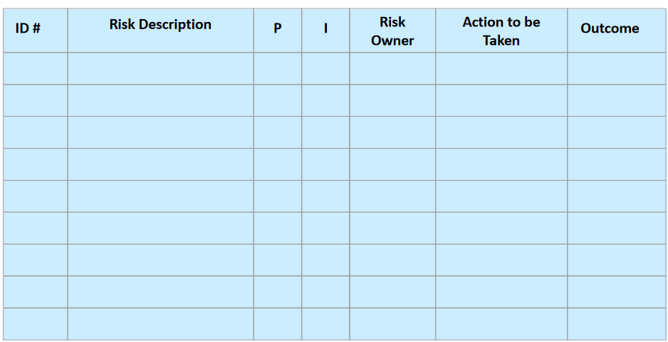
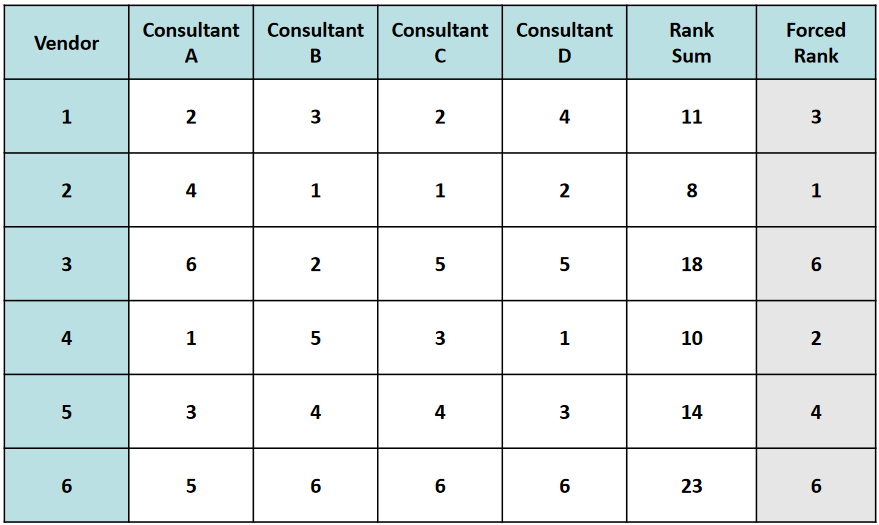
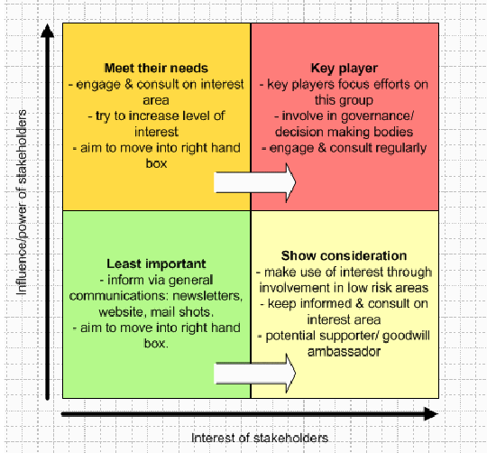

# Definizione dei Processi

## Scoping process group

Creare una _dichiarazione generale_ degli _obiettivi_ e del _business value_ del progetto.

Processi:

- Ottenere i **veri bisogni** del cliente e documentarli
- **Descrizione sintetica** del progetto
- Ottenere l'**approvazione del senior management**

## Planning process group

Identificare le _attività_ che devono essere svolte, stimare _tempi_, _costi_ e _risorse_ necessarie.

Processi:

- Definire le **attività**
- Stimare tempi, costi e risorse per ciascuna attività
- Costruire la **schedula** iniziale
- Scrivere il piano di **gestione del rischio**
- Documentare il piano di progetto
- Ottenere l'**approvazione del senior management**

## Launching/Executing process group

Selezionare il _personale_, stabilire le _regole operative_, aiutare il team a lavorare assieme.

Processi:

- **Reclutare i membri del team**
- Stabilire le **regole operative**
- Stabilire il processo per il **cambiamento di scope**
- Gestire le **comunicazioni**
- Scrivere i **Work packages**

## Monitoring & Controlling process group

Verificare lo _stato di avanzamento_ del progetto rispetto al piano, risolvendo eventuali problemi o richieste di modifica.

Processi:

- Stabilire le **performance** di interesse
- Stabilire il **sistema di reporting**
- Monitorare performance e rischio
- Risolvere problemi/cambiamenti di scope

## Closing process group

Assicurare che siano stati soddisfatti tutti i requisiti, consegnare i deliverables, decretare la fine formale del progetto.

Processi:

- Pianificare l'**installazione/consegna**
- Ottenere l'**approvazione** del cliente
- Scrivere il **rapporto finale**
- Verificare **post-implementazione**

## PMLC e Proccess Groups

I process groups non corrispondono direttamente alle fasi del PMLC, ma possono essere mappati in modo articolato per creare un PMLC.
Infatti i process groups non sono sequenziali, ma possono sovrapporsi e interagire tra loro durante il ciclo di vita.

## Project Management Knowledge Areas

Aree di specializzazione dei processi all'interno di un progetto.

### Integration Management

Effettuare il **collegamento tra diversi deliverables**, la cui integrazione è utile alla soluzione del progetto.

In realtà, il concetto di integration può essere applicato anche a diverse aree (risorse umane, attività, costi, ecc)

### Scope Management

C'è differenza tra ciò che il cliente vuole e ciò di cui ha bisogno.
Perciò i processi di scope management mirano anche a fare in modo di trovare ciò di cui il cliente ha davvero bisogno, identificando l'**intersezione tra i desideri e i bisogni** del cliente.
Questo avviene tramite il processo per determinare le **conditions of satisfaction**, ovvero un ciclo che parte da una richiesta del cliente e arriva a una risposta da parte del PM, con eventuali chiarimenti da entrambe le parti, fino a negoziare un accordo.
Nel frattempo viene stilato il **Project Overview Statement** e si iniziano a descrivere i requisiti, che possono essere schematizzati tramita la **Requirements Breakdown Structure (RBS)** (oppure user stories).

### Time Management

La produttività nel tempo non è sempre ottimale (non sempre arriva al totale di ore uomo assegnate).
Potrebbero esserci delle interruzioni non pianificate, dei cali di produttività, altri progetti concorrenti, ecc.
Questo può introdurre **ritardi non pianificati**.
Per questo motivo è importante riuscire, almeno in parte, a prevedere queste eventualità quando si fanno le stime dei tempi, considerando:

- somiglianza con dati simili/storici
- pareri di esperti
- quantità di risorse allocate (tenendo conto che non è detto che i tempi scalino in maniera lineare)
- tecniche formali per le stime (delphi, three-point, ...)

### Cost Management

Processi da eseguire sia durante la _pianificazione_ per definire il **budeget** per le varie attività, sia durante l'_esecuzione_ per **monitorare i costi** e gestire le variazioni rispetto alle stime.

I costi da controllare sono:

- manodopera
- beni strumentali
- servizi appaltati
- spese di trasferta

### Quality Management

Qualità del prodotto vs Qualità del processo.
Dipende dai seguenti aspetti:

- adeguatezza del deliverable all'uso
- quanto aumenta il business value
- la consegna entro il limite di tempo e di budget

Devono essere considerati tre processi:

- Quality planning
- Quality assurance
- Quality control

Il **quality planning** consiste nel determinare gli **standard di qualità** rilevanti e produrre il **piano della qualità**, ovvero:

- **Policies** di qualità;
- **Metriche** per misurare la qualità;
- **Programma di miglioramento del processo**.

La **quality assurance** mira a garantire il rispetto del piano di qualità, tramite:

- **Quality audits**
- **Process analysis**
- **Project quality management tools**

Il **quality control** prevede il monitoraggio delle performance la definizione delle azioni da intraprendere in caso di mancata conformità.

### Human Resources Management

Per ogni componente del team devono essere definite le competente e le abilità, poichè hanno un forte impatto sul progetto.
In più è fondamentale che le risorse umane siano sia **motivati** a lavorare al progetto, sia che l'**ambiente di lavoro** sia il più confortevole possibile.

### Communications Management

**Comunicazione** = processo che consiste nel passaggio di informazioni da una persona a un'altra che deve comprenderla.

Tipologie:

- **One to One**: es conversazioni, riunioni
- **Elettronica**: es email, websites
- **Scritta**: es lettere, documenti, report

### Risk Management

Domande:

- Quali sono i rischi e le perdite associate (anche nel caso peggiore)?
- Quali alternative o modi di eliminare/ridurre le perdite esistono?
- Le alternative comportano ulteriori rischi?

Fasi del ciclo di vita:

- **Risk Identification**: valutare quali rischi si presentano per il progetto
    - **Technical risks**: rischi legati alla tecnologia e al suo impiego
    - **Project Management risks**: inadeguata cura nella gestione del progetto (es allocazione risorse, struttura di gestione, pianificazione, ...)
    - **Organizational risks**: problemi di sostenibilità, conflitti, risorse inadeguate
    - **External risks**: rischi legati a fattori esterni come il committente, fornitori, scioperi, ecc
- **Risk assessment**: valutare la probabilità che si verifichino gli eventi avversi (_risk drivers_) e il loro impatto. Ogni driver viene prioritizzato in base all'_impatto atteso_, ovvero il prodotto tra la sua probabilità e l'impatto effettivo.
    - **Risk assessment statico**: valutazione svolta all'inizio durante il planning
    - **Risk assessment dinamico**: aggiornamento in corso d'opera delle valutazioni statiche, una volta acquisite più informazioni
- **Risk Mitigation**: valutazione delle alternative e del modo per eliminare le perdite, ovvero
    - **Accept**: accettare il rischio e sperare che non capiti l'evento avverso
    - **Avoid**: modificare il piano per eliminare la situazione di rischio
    - **Contingency planning**: stabilire cosa fare _in futuro_ se l'evento dovesse accadere
    - **Mitigate**: stabilire cosa fare _subito_ per minimizzare l'impatto
    - **Transfer**: trasferire l'impatto ad altri
- **Risk monitoring & control**: monitorare in corso d'opera lo stato del progetto per verificare le probabilità che i risk drivers accadano
    - **Risk log**: documento in cui vengono trascritti tutti i rischi, insieme alle azioni intraprese e i risultati ottenuti; in più ogni driver ha assegnato un _risk owner_ che è responsabile per il monitoraggio di quel rischio

### Procurement Management

Ricercare dei **fornitori esterni** per ricevere prodotti, materiali o servizi, al fine di ridurre rischi/costi/tempi.

#### Vendor solicitation

Ricercare i fornitori e sollecitarli a fornire un'offerta
- Si parte dai requisiti e si stabilisce che per alcuni di essi può essere più conveniente affidarsi a fornitori esterni
- Viene nominato un _Procurement management team_ (PMT, di solito l'ufficio acquisti oppure un team temporaneo) che si occuperà delle relazioni con i fornitori
- Viene decisa la _strategia di acquisizione_
- Creare una _Request for Proposal_ da distribuire ai fornitori
- Rispondere alle eventuali domande dei vendors

**Request for proposal**: documento contenente i dettagli necessari ai vendors per capire se possono soddisfare la richiesta, preparato dal PMT.
In più deve **stimolare** i vendors a partecipare alla selezione.
Deve contenere:

- descrizione del problema/opportunità
- opzionalmente RBS/POS
- stime di costi e tempi
- criteri di selezione
- dettagli amministrativi del contratto
- riferimenti per i vendors

Come ricercare i vendors: **Request for information**, pubblicità, fornitori abituali, fiere, ecc.

#### Vendor evaluation

Vengono ricevute e valutate le risposte alla request for proposal.
Inizialmente l'obiettivo è ridurre la lista dei possibili fornitori per ridurre al minimo l'overhead.
È inoltre possibile richiedere ulteriori presentazioni/demo dell'offerta proposta.

Si possono usare dei metodi formali per confrontare le offerte rimaste dopo la scrematura iniziale:

**Forced ranking**: più consulenti creano una classifica delle offerte, la classifica finale è data dalla somma delle classifiche singole.
Soffre del fatto che la classifica non è pesata e quindi c'è poca granularità.

**Paired comparison**: si fanno i confronti a due a due tra le offerte e la classifica è data dal numero di vittorie di ciascun vendor.

Avere una classifica è fondamentale perchè se in fase di contrattazione ci dovessero essere problemi, si può sempre andare al vendor successivo.

#### Vendor selection

Scegliere l'offerta più adeguata al progetto.
L'esito può essere:

- **No award**: nessun fornitore è in grado di soddisfare la richiesta, bisogna ripartire da capo, abbandonare il progetto oppure sfruttare la mancanza di mercato come opportunità per un nuovo progetto
- **Single award**: fornitore unico
- **Multiple awards**: non c'è un unico fornitore che può soddisfare tutte le necessità, ma più fornitori possono dividersi i requisiti

#### Vendor contracting

Contrattare con i fornitori per avere una collaborazione formale, a seconda del fatto che la selezione abbia prodotto un solo vincitore o più di uno.

L'output di questo processo è un **contratto**.

#### Vendor Management

Fare partecipare il fornitore durante la fase di sviluppo per assicurarsi che il lavoro venga svolto secondo i piani e che l'integrazione sia fattibile.
Inoltre, è necessario monitorare la fase di _collaudo_ e la _transizione tra il fornitore e il cliente finale_.

### Stakeholder Management

Definizioni di **stakeholder**:

- qualcuno che ha _interesse_ o che è _coinvolto_ in un'organizzazione
- qualcuno interessato al risultato di un progetto
- qualcuno che può essere influenzato da un'iniziativa o avere effetto su di essa

> PMBOK: Individuo, gruppo o organizzazione che può avere effetto su/essere influenzato da una decisione, un'attività o il risultato di un progetto.

Questi effetti possono essere sia **negativi**, sia **positivi**.
Uno stakeholder può essere interno o esterno all'ente e può anche essere molto lontano dal progetto per essere considerato tale.
All'interno del progetto, gli stakeholder sono i membri del team di progetto.

Fino alla 4a edizione, gran parte dei processi di gestione degli stakeholder erano già presenti all'interno della knowledge area della comunicazione.
Dalla 5a edizione la gestione degli stakeholder è stata ritenuta degna di diventare una knowledge area a sè stante, per sottolineare l'importanza della loro partecipazione _attiva_.

Processi coinvolti:

- **Identify Stakeholders**: identificare gli stakeholder e documentare i relativi interessi e/o impatti sul progetto
- **Plan stakeholder management**: sviluppare una strategia per coinvolgere efficacemente gli stakeholder durante il progetto
- **Manage stakeholder engagement**: comunicare e lavorare con gli stakeholder per accontentare i loro bisogni
- **Control stakeholder engagement**: monitorare la relazione complessiva con gli stakeholder e aggiustare le strategie di conseguenza

**Stakeholder analysis**: tecnica per raccogliere informazioni _quantitative_ e _qualitative_ e analizzarle al fine di determinare quali interessi considerare durante il progetto.
Per questo, può essere comodo fare riferimento alla **stakeholder matrix**,  che incrocia l'interesse degli stakeholder con la loro influenza sul progetto.
Nelle celle della tabella sono presenti i modi in cui tendenzialmente ci si dovrebbe comportare con le varie categorie di stakeholder.

